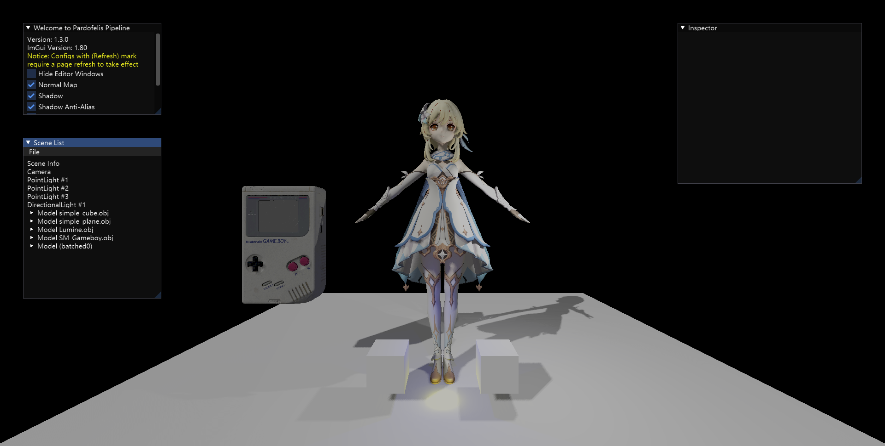
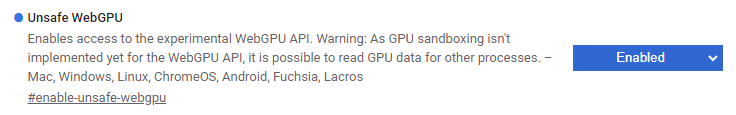

# Pardofelis Pipeline

<image src="doc_resource/pardofelis-pipeline-logo-text.png" width="50%" />

**Pardofelis** - A tiny deferred rendering pipeline based on WebGPU. (Bachelor dissertation project)

Live demo: (current version: v1.3.1)

- Forward pipeline: https://pardofelis.kskun.com/demo/forward
- Deferred pipeline: https://pardofelis.kskun.com/demo/deferred

The server is located in mainland China with limited bandwidth, so assets loading can take many seconds.

## Recommended Browser

We develop and test this project on a Google Chrome browser. You can get the Canary version of Chrome at [its website](https://www.google.com/chrome/canary/). A recommended version of Google Chrome Canary is any not lower than 114.0.5735.6.

Before open the live demo or a demo running locally, WebGPU should be enabled in your browser. For a Google Chrome Canary browser, you can find "Unsafe WebGPU" item in [`chrome://flags`](chrome://flags) page. Then set this item to "Enabled" and restart the browser.

Google Chrome Canary on an Android mobile device is also supported. The same operation to enable WebGPU as above is required.

## Build & Run

Pardofelis Pipeline is created by a Vue template. To configure the project, NodeJS and NPM are required.

### Prepare Dependencies

Run `npm install` on project root. NPM will fetch all dependencies to `node_modules` folder.

### Run a Demo

Run `npm run dev` on project root. You will find a URL in the terminal like `http://localhost:5173/`. Then append `demo/forward` to it for a forward demo page or `demo/deferred` for a deferred one.

We also provide a live demo with details above.

### Build

Run `npm run build` on project root. Built files can be found in `dist` folder.

## Q&A

### Blank page with no text

May cause by a wrong URL. Check if the URL is one of `demo/forward` or `demo/deferred`.

### Blank page with text "WebGPU is not supported!"

Your browser doesn't support WebGPU API currently. Try upgrade the browser or check if proper development flag is set.

### "Loading Assets..." never ends

- Network connection is slow or broken. Check network connectivity.
- Something is wrong with the pipeline. Collect error message in your browser's console and contact us.
- For a Firefox browser, it may mean WebGPU is not supported.

## Reference

- WebGPU, W3C, https://www.w3.org/TR/webgpu/
- WebGPU Shading Language, W3C, https://www.w3.org/TR/WGSL/
- Learn OpenGL, Joey de Vries, https://learnopengl.com/
- WebGPU Samples, WebGPU (GitHub org), https://webgpu.github.io/webgpu-samples
- Dear ImGui JavaScript + WebGL example, flyover, https://flyover.github.io/imgui-js/example/
- Get started with GPU Compute on the web, François Beaufort, https://developer.chrome.com/articles/gpu-compute/
- Hierarchical-Z map based occlusion culling, (RasterGrid), https://www.rastergrid.com/blog/2010/10/hierarchical-z-map-based-occlusion-culling/

## Resource

- Pardofelis (Honkai 3rd), Illustration (used as project logo), https://www.pixiv.net/artworks/96506224
- Lumine (Genshin Impact), OBJ Model, https://www.models-resource.com/pc_computer/genshinimpact/model/45957/
- Game Boy Classic, FBX Model (converted to OBJ), https://sketchfab.com/3d-models/game-boy-classic-0ae80019e6f046168923286d7e628f6f