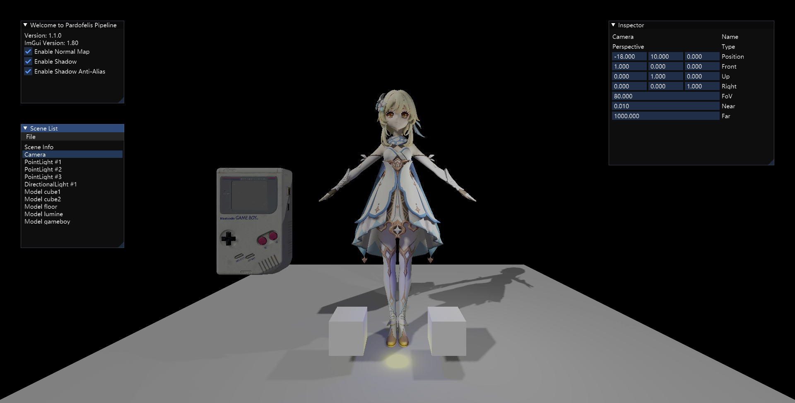

# Pardofelis Pipeline

<image src="pardofelis-pipeline-logo-text.png" width="50%" />

**Pardofelis** - A tiny deferred rendering pipeline based on WebGPU. (Bachelor dissertation project)

Live demo: (current version: v1.1.0)

- Forward pipeline: https://pardofelis.kskun.com/demo/forward
- Deferred pipeline: https://pardofelis.kskun.com/demo/deferred

## Reference

- GPU Driven Rendering, TingXia1028, https://tingxia1028.github.io/cgbook/pipeline/gpudriven/resource.html
- WebGPU, W3C, https://www.w3.org/TR/webgpu/
- WebGPU Shading Language, W3C, https://www.w3.org/TR/WGSL/
- Learn OpenGL, Joey de Vries, https://learnopengl.com/
- WebGPU Samples, WebGPU (GitHub org), https://webgpu.github.io/webgpu-samples

## Resource

- Pardofelis (Honkai 3rd), Illustration (used as project logo), https://www.pixiv.net/artworks/96506224
- Lumine (Genshin Impact), OBJ Model, https://www.models-resource.com/pc_computer/genshinimpact/model/45957/
- Game Boy Classic, FBX Model (converted to OBJ), https://sketchfab.com/3d-models/game-boy-classic-0ae80019e6f046168923286d7e628f6f